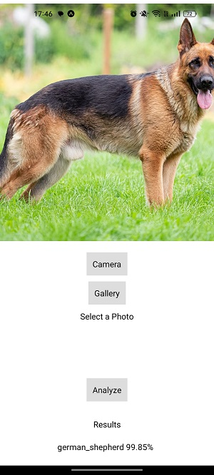

# Woof Vision
Woof Vision is a computer vision project that uses the **ViT L32 transformer model** to recognize up to **120 different dog breeds** and **common dog crossbreeds** from a single photo. This project showcases the transfer learning capabilities of TensorFlow and the power of using advanced algorithms in Computer Vision.

```
Tags : Python, JavaScript, TensorFlow, React Native, Flask, Keras, Jupyter Notebook
```

 * The mobile app is built using React Native, while the backend is powered by Flask.

 * The repository includes a Jupyter Notebook that explains the training process in detail, providing a deeper understanding of the model. It also showcases the usage of data augmentation, transfer learning and other techniques.

# Why
This project was created as a demonstration of the skills and knowledge gained during an internship in Machine Learning.

# App Look Disclaimer
As I am new to React Native, the app is kept simple and basic, with a focus on the functionality of the Computer Vision model. Despite its rough appearance, the project provides a solid foundation for future improvements and developments.

# Model Statistics
The model was able to get to a 92.3% validation accuracy with 0.2835 loss as sparse categorical cross entropy. Each step took ~310s to train (94*128 images).


# Gallery




# Structure
The structure of the project is the following :
 - App : mobile React Native app using Expo
 - API : flask web API using Docker
 - Model : training process on Tensorflow using Jupyter Notebook
